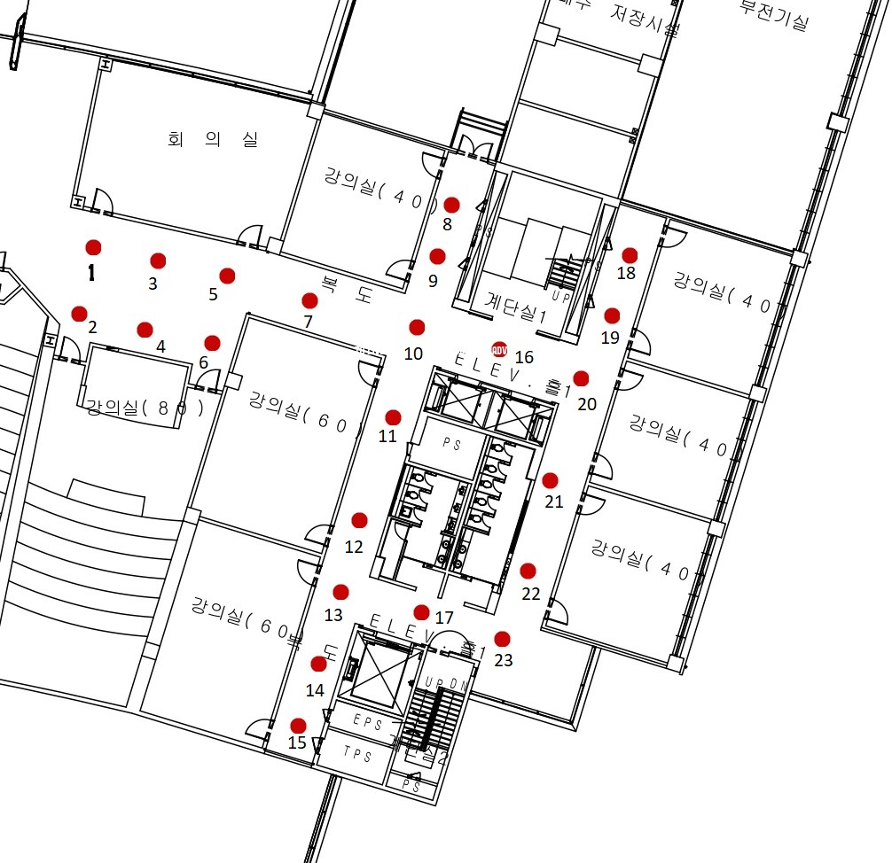

# Indoor Localization

##Description
This is Mobile Application which uses Machine Learning to detect indoor location.
The app specifically made for infoor localization at UNIST university, 106 building, 2nd floor.
My app reads WIFI RSSI signals then makes classification using Deep Learning to detect location.

##Data Collection
The biggest challenge is this project was a data collection. 
In fact, my phone detects up to 130 different WIFI signals, thus I had to choose most importtant signals.
So I have picked 12 WIFI signals that can be received from any point on 2nd floor.
I have made an [app](https://github.com/kanybekasanbekov/indoor_localization/tree/master/wifiinfo)(wifiinfo folder) which reveives those 12 signals and saves it in txt file as an array.
Data was collected from 23 location, image attached below.
Dataset can be found in [WIFI_DATA](https://github.com/kanybekasanbekov/indoor_localization/tree/master/WIFI_DATA) folder.
In total approximately 4600 datapoints were collected.

    

##Train
Before training, I had to manage the data: divide into train and test sets, save the data in approriate numpy folder.
The code for that is in [data_management](https://github.com/kanybekasanbekov/indoor_localization/blob/master/data_management.py) file.

When data is prepaired it is time for training.
The model built with [Tensorflow 1.12.0](https://www.tensorflow.org/) and it's [Keras 2.2.4](https://keras.io/) library.
Network itself of multiple layers. "Adam" optimizer and "Categorical Crossentropy" loss were used for training.
After training, trained model was saved on converted into tflite version in Google Collab.

##Test 
When model was ready, it was deployed into mobile app.
So for testing, whenever you want to know your location you should press on a button then app shows your position on map.
As you move in building, app reads new WIFI signals makes inference and shows your new position.
Moreover, the app can draw in moving path as in a photo below.

    

